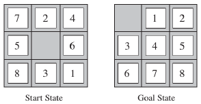

# Inteligência artificial
## 1. O problema do fazendeiro

Considere o seguinte cenário: "um fazendeiro está levando uma raposa, uma galinha e um saco de grãos para casa. Para chegar lá, ele precisa atravessar um rio de barco. Só que ele pode levar consigo apenas um item de cada vez. Se a raposa for deixada sozinha com a galinha, ela comerá a galinha. Se a galinha for deixada sozinha com os grãos, ela comerá os grãos. Como o fazendeiro poderá atravessar o rio mantendo todo seu suprimento intacto?". Esta situação pode ser modelada como um problema de busca. Pede-se:

* **Formulação do problema:**

  A primeira consideração que fizemos foi delegar que margemEsquerda será a margem objetivo e margemDireita será a margem inicial.
  Então, atribuimos uma numeração para cada item (saco de grãos, raposa e galinha), para que o código fique mais limpo.

      grãos -> 1
      raposa -> 2
      galinha -> 3

  No caso do fazendeiro, vamos considerá-lo como um bit de sinal (0 ou 1), para indicar em qual margem do rio ele está.  
  Para representar um estado vamos usar uma lista, na qual cada posição será um item. Por exemplo, para o estado inicial:

  estadoInicial = [0,0,0,0,1,1,2,3]

  - Os quatro primeiros elementos da lista (estadoInicial[:4]) referenciam a margem esquerda e, os quatro últimos (estadoInicial[4:]), a margem direita. 
  - O primeiro item de cada margem (estadoInicial[0] e estadoInicial[4]) simboliza o fazendeiro Quando ele é 0, significa que o fazendeiro não se encontra nessa margem.
  - As outras posições da lista só podem receber um valor cada uma, ou seja, os itens não podem mudar de lugar na margem. Sendo assim, estadoInicial[1] e estadoInicial[5] só podem receber o valor específico de grão (1), estadoInicial[2] e estadoInicial[6] só podem receber o valor específico de raposa (2), estadoInicial[3] e estadoInicial[7] só podem receber o valor específico de galinha (3).
  - O 0 siginifica que nenhum item se encontra naquela margem.

  Como exemplo, o estado em que o fazendeiro atravessou a galinha para a margem esquerda:

  estado = [1,0,0,3,0,1,2,0]

  Feitas as considerações, temos:

  - **Estado inicial**: [0, 0, 0, 0, 1, 1, 2, 3] (Todos na margem direita do rio);
  - **Ações possíveis**: Escolher item, atravessar o rio;
  - **Modelo de transição**: Ao executar a ação de atravessar o rio, devolver quais itens estão em cada margem;
  - **Teste de objetivo:** verificar se todos os itens estão na margem esquerda do rio (margem da casa);
  - **Custo do caminho:** 1 para cada ação de atravessar o rio;

  Colocamos a ação de escolher item, para os casos em que o fazendeiro precisa atravessar o rio sem levar nenhum item. Ele precisa decidir se vai levar um item ou não.

  O algorítmo do fazendeiro encontra-se no arquivo [algoritmo_do_fazendeiro.py](algoritmo_do_fazendeiro.py). Para utilizar basta digitar no terminal: 
  ```terminal
  $ python algoritmo_do_fazendeiro.py
  ```


## 2. O problema do quebra-cabeça de 8 peças

Consiste em um tabuleiro 3x3 com oito peças numeradas e um quadrado vazio. Uma peça ao lado do quadrado vazio pode deslizar para esse quadrado. O objetivo é alcançar um estado objetivo especificado. A imagem abaixo facilita o entendimento do problema.



* **Formulação do Problema**

  Usamos o algoritmo de busca A*, onde sabemos que é uma busca baseada na melhor escolha em que avalia os nós através da combinação de g(n), o custo para alcançar o nó, e h(n), o custo para ir do nó ao objetivo. 
  A heurística é a forma mais comum de como o conhecimento adicional do problema é transmitido ao algoritmo de busca, dito isso, escolhemos a heurística de distância Manhattan, que consiste na soma das distâncias das peças de suas posições até a posição que deveriam estar.
  Com base nisso, o algoritmo vai verificar em relação ao estado atual, para onde ele pode mover o 0 e com base no custo do caminho somado a heuristica de cada peça, considerar a menor quantidade de passos possíveis, sempre checando se na borda possui um mesmo filho com custo maior, caso verdadeiro ocorrerá a substituição do mesmo.

  Feita as considerações, temos:

  - **Estado inicial:** [
        [7, 2, 4],
        [5, 0, 6],
        [8, 3, 1]
]
  - **Ações possíveis:** Esquerda, direita, cima e baixo;
  - **Modelo de transição:** Dado um estado e uma ação, ele devolve o estado resultante. Por exemplo, se a ação do estado inicial acima for direita, ocorrerá a troca de posição entre 0 e 6.
  - **Teste de objetivo:** Verificar se o estado corresponde a [
    [0, 1, 2],
    [3, 4, 5],
    [6, 7, 8]
]
  - **Custo do caminho:** 1 para cada passo, logo o custo de caminho é o número de passos do caminho.

  O algoritmo do quebra-cabeça de 8 peças encontra-se no arquivo [quebra_cabeca.py](quebra_cabeca.py). Para utilizar basta digitar no terminal: 
  ```terminal
  $ python quebra_cabeca.py
  ```

O algoritmo para a distância de Manhattan foi baseado [nessa discussão do stack overflow](https://stackoverflow.com/questions/16318757/calculating-manhattan-distance-in-python-in-an-8-puzzle-game)
