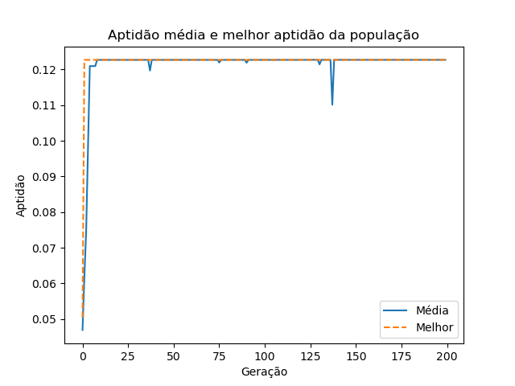

# Maximizador de função de duas variáveis

## O Problema

O problema consiste em maximizar a função:

  * 1/(1 + f(x))

onde f(x) é dada por: 

  

Também pede-se para apresentar as curvas da evoulução da aptidão média da população e da evolução da melhor aptidão da população, por geração. Os cromossomos binários devem possuir tamanho de 64 bits (32 para codificar *x<sub>1</sub>* e 32 para codificar *x<sub>2</sub>*).

## O Algoritmo

Então basicamente, o algoritmo se inicia com uma população aleatoriamente escolhida, após isso essa população passará pela fitness function onde a mesma serve para medir o desempenho de cada cromossomo daquela população, onde ela serve como base para a seleção de cromossomos que irão cruzar. Após isso será feita a seleção aleatória de cromossomos para reproduzirem, onde essa seleção possui um peso (os cromossomos com maior valor na fitness function terão mais chances de serem escolhidos) e também o algoritmo faz uma checagem para saber se o par de cromossomos que irá cruzar não é igual. Caso seja, ele busca outro cromossomo para o cruzamento. Também é feita uma checagem se aquele par de cromossomos possui uma taxa de reprodução dentro da estabelecida inicialmente no problema. A partir disso, cada casal escolhido para cruzar irá gerar um par de filhos, onde os mesmos podem sofrer mutação ou não (depende da taxa estabelecida inicialmente e se aquele filho a satisfaz). Então, a quantidade de filhos da geração posterior será igual a da geração anterior, de forma que o filho com menor valor da fitness function deverá ser substituído pelo melhor indivíduo gerado na geração anterior a esse filho, aplicando então o elitismo. O algoritmo irá continuar gerando gerações de indivíduos onde irá parar quando chegar no limite de gerações estabelecidas.

O algoritmo pode ser visualizado [aqui](maximizer.py)

## Utilização

Para utilizar, instale as dependências em [requirements.txt](requirements.txt) (use um ambiente virtual):

```
$ pip install requirements.txt
```
ou, apenas faça a instalação do matplotlib, que já vem com todas essas dependências:

```
$ pip install matplotlib
```
Então, execute o arquivo [maximizer.py](maximizer.py), e forneça os dados de entrada:

```
$ python maximizer.py
```

## Resultados

A taxa de cruzamento foi mantida em 0.8 e a taxa de mutação em 0.01.

* **Ponto A:**
  - tamanho da população: 6
  - quantidade de gerações: 200

  **Resultado**: máximo local

  

* **Ponto B:**
  - tamanho da população: 60
  - quantidade de gerações: 100

  **Resultado**: máximo local

  

* **Ponto C:**
  - tamanho da população: 120
  - quantidade de gerações: 100

  **Resultado**: máximo local

  

* **Ponto D:**
  - tamanho da população: 240
  - quantidade de gerações: 50

  **Resultado**: máximo global

  

### Plotagem da função com os pontos


---
Para alguns detalhes utilizou-se os seguintes apoios:

[tutorial de random](https://code.tutsplus.com/pt/tutorials/mathematical-modules-in-python-random--cms-27738)

[Normalizar dados entre 0 e 1](https://qastack.com.br/stats/70801/how-to-normalize-data-to-0-1-range)
